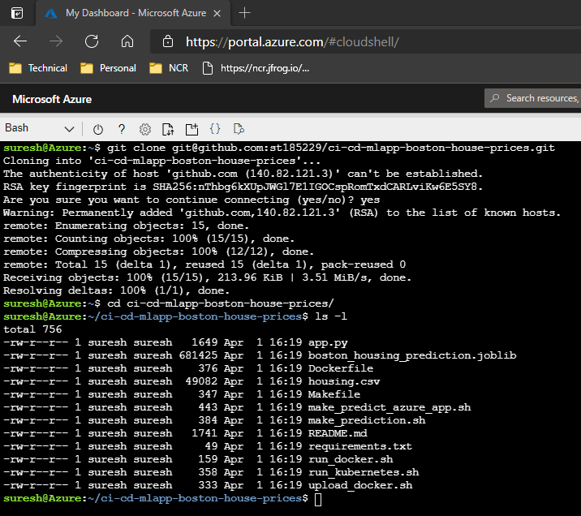
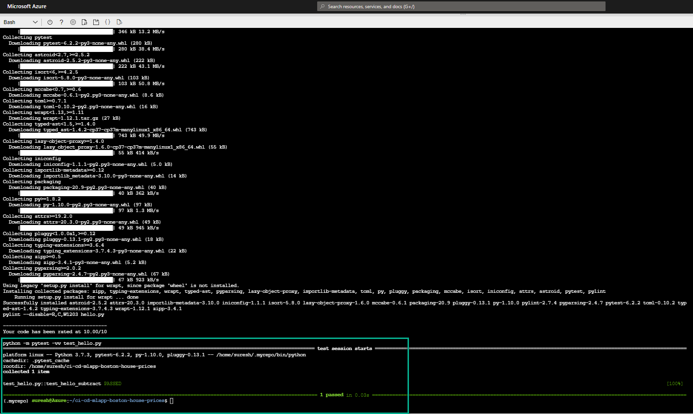

# Overview

<TODO: complete this with an overview of your project>

The repo details below

| Access method/Protocol | URL |
| --- | --- |
| ssh | git@github.com:st185229/ci-cd-mlapp-boston-house-prices.git |
| https | https://github.com/st185229/ci-cd-mlapp-boston-house-prices.git |
| Github CLI | gh repo clone st185229/ci-cd-mlapp-boston-house-prices |


## Project Plan

<TODO: Project Plan

* The trello board for the project can be found [here](https://trello.com/b/Km5JLrLN/kanban-template)
* The project plan can be
  found [here](https://docs.google.com/spreadsheets/d/1yygJ9PV_wxpk3kbqM87wVp3qiB8wB9OQIBr93LUTuAU/edit?usp=sharing)

## Instructions

<TODO:

### Architectural Diagram (Shows how key parts of the system work)>

<TODO:  Instructions for running the Python project. How could a user with no context run this project without asking
you for any help. Include screenshots with explicit steps to create that work. Be sure to at least include the following
screenshots:

### Project running on Azure App Service

### Project cloned into Azure Cloud Shell

The screenshots of clone using ssh is below 



### Passing tests that are displayed after running the `make all` command from the `Makefile`

### Output of a test run



### Successful deploy of the project in Azure
  Pipelines.  [Note the official documentation should be referred to and double checked as you setup CI/CD](https://docs.microsoft.com/en-us/azure/devops/pipelines/ecosystems/python-webapp?view=azure-devops)
  .

### Running Azure App Service from Azure Pipelines automatic deployment

### Successful prediction from deployed flask app in Azure Cloud
  Shell.  [Use this file as a template for the deployed prediction](https://github.com/udacity/nd082-Azure-Cloud-DevOps-Starter-Code/blob/master/C2-AgileDevelopmentwithAzure/project/starter_files/flask-sklearn/make_predict_azure_app.sh)
  . The output should look similar to this:

```bash
udacity@Azure:~$ ./make_predict_azure_app.sh
Port: 443
{"prediction":[20.35373177134412]}
```

* Output of streamed log files from deployed application

>

## Enhancements

<TODO: A short description of how to improve the project in the future>

## Demo

<TODO: Add link Screencast on YouTube>


